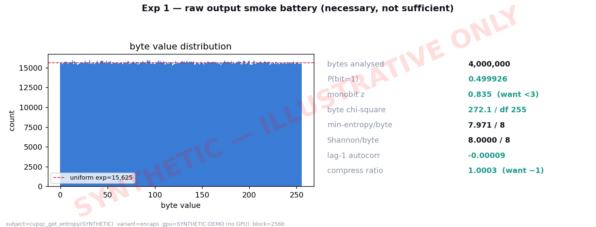
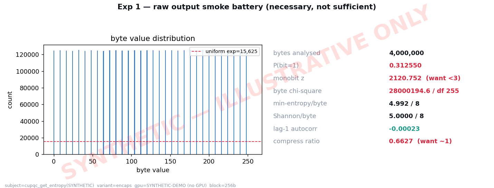
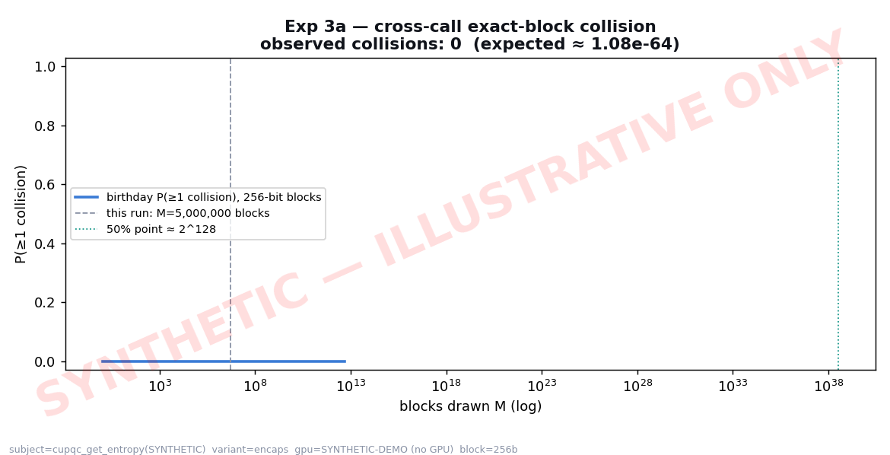
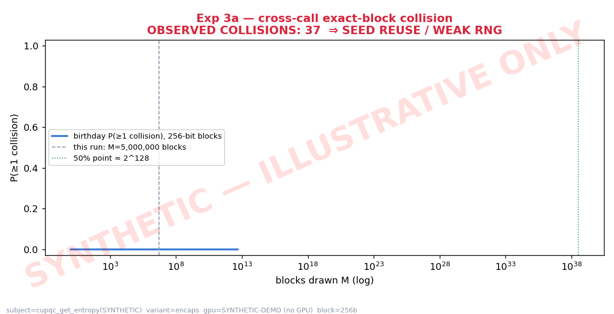
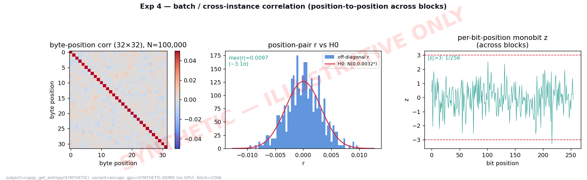
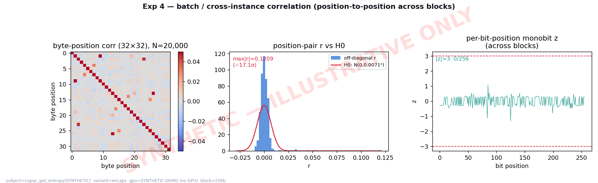

# In Quest of Entropy — cuPQC `get_entropy()`

Empirically probing the randomness that NVIDIA **cuPQC** feeds into ML‑KEM.

> **Status:** harness + analysis complete; **results pending a GPU run.** The
> figures shown below are **clearly‑labeled synthetic illustrations** of what
> each experiment produces — they are *not* cuPQC measurements. Replace them
> with real output by running the harness on a machine with an NVIDIA GPU and
> the cuPQC SDK (see [Build & run](#build--run)).

---

## Research question

> **RQ.** Is the per‑operation randomness produced by NVIDIA cuPQC's
> `get_entropy()` — the *only* entropy source on cuPQC's ML‑KEM keygen and
> encapsulation paths — unpredictable and free of exploitable structure, and is
> its quality auditable at all?

This matters because `get_entropy()` is the sole supplier of the ML‑KEM message
`m` (32 B, encapsulation) and seed `d‖z` (64 B, key generation). Its
implementation lives inside the **closed** static library `libcupqc.a`; NVIDIA's
documentation says only that it uses *"cryptographically secure randomness,"*
**never naming the generator or its reseed semantics.** We confirmed (see
[`docs/SOURCE_AUDIT.md`](docs/SOURCE_AUDIT.md)) that *no open‑source
`get_entropy` exists anywhere* — not in NVIDIA's samples, not in the Apache‑2.0
liboqs cuPQC backend, which simply calls it and trusts it. So the only way to
say anything about it is to **probe its output at runtime.**

### Why output tests can't be the whole story (scope honesty)

- **Necessary, not sufficient.** Passing NIST SP 800‑22 / PractRand / dieharder
  on the *output* cannot distinguish a sound CSPRNG from a backdoored or
  low‑entropy one with the same output distribution. We treat Experiment 1 as a
  screen, not a proof.
- **SP 800‑90B is structurally inapplicable here.** 90B assesses a *raw noise
  source*; `get_entropy()` exposes only conditioned output and no raw source.
  We therefore cannot measure source min‑entropy `H∞` — we can only **upper‑bound**
  it. That inapplicability is itself a reportable result (the data‑processing
  ceiling, made empirical).
- The decisive, *falsifiable* questions are structural: **collisions** (seed
  reuse), **cross‑instance correlation** (per‑thread weak generators), and
  **clone‑determinism / seed provenance** (is it host‑seeded from `getrandom()`
  or device‑self‑seeded?). Those are Experiments 3 and 4.

---

## Hypotheses

**Global null `H0` (ideal‑CSPRNG model).** `get_entropy()` output is
computationally indistinguishable from a uniform random byte stream: each
per‑operation block is independent and uniform on `{0,1}^(256 or 512)`.

**Global alternative `H1`.** The output exhibits at least one detectable
departure: value bias, periodicity, exact‑block collisions below the birthday
bound, inter‑position / inter‑instance correlation, or determinism under
process/VM cloning.

Operationalized per experiment:

| Exp | `H0` (fail to reject = "looks ideal") | `H1` (reject `H0` = defect found) | Decision rule |
|----|----|----|----|
| **1 Output battery** | uniform, unbiased, incompressible | byte bias, periodicity, compressibility | NIST STS proportion + uniformity; smoke screen first |
| **3a Collision** | 0 exact block collisions for `M ≪ 2^(b/2)` | ≥1 exact collision | any collision ⇒ reject (catastrophic) |
| **3b Clone determinism** | distinct entropy across cloned VM/process snapshots | identical entropy across clones | any cross‑clone match ⇒ reject |
| **3c Seed provenance** | (descriptive) | — | `strace` shows `getrandom`/`/dev/urandom` or not |
| **4 Batch correlation** | position‑pair `\|r\|` ~ `N(0, 1/√N)`; monobit `\|z\|<3` | `\|r\| ≫ 5/√N` or many `\|z\|>3` | per‑position corr + transposed monobit |

A single rejection in 3a, 3b, or 4 is sufficient to refute `H0` for the deployed
configuration.

---

## Experiments

The harness ([`harness/entropy_probe.cu`](harness/entropy_probe.cu)) extracts the
device entropy buffer straight back to the host (`get_entropy → cudaMemcpy →
release_entropy`), so **no ML‑KEM kernel is even required** to capture `m`/seed.

- **Experiment 1 — output battery** (`mode dump`): stream raw entropy to a file
  and run external batteries (NIST STS, PractRand, dieharder, `ent`) plus the
  built‑in smoke screen in `analyze.py`.
- **Experiment 3a — cross‑call collision** (`mode collision`): draw millions of
  independent per‑operation blocks (default one `get_entropy` call each, mirroring
  the liboqs batch=1 pattern) and test for any exact block recurrence. For
  256/512‑bit blocks, *any* collision is a smoking gun.
- **Experiment 3b/3c — clone & provenance** (`scripts/clone_test.sh`,
  `scripts/strace_provenance.sh`): snapshot/fork around the call and diff the
  buffers; trace host syscalls to see whether the seed comes from the Linux RNG.
- **Experiment 4 — batch correlation** (`mode batchcorr`): one batched draw of
  `N` blocks → `N×blocksize` matrix → **position‑to‑position** correlation across
  blocks (the sound test; block‑to‑block Pearson over 32 samples is just noise)
  plus a transposed per‑bit‑position monobit. Catches per‑thread generators
  seeded by `threadIdx`‑style hashing.

**Experiment 2 (SP 800‑90B)** is intentionally omitted: inapplicable to
conditioned output (see scope note above).

---

## Visual demonstration (SYNTHETIC — illustrative only)

Each experiment under a **clean** ideal stream (fail to reject `H0`) vs. a
**broken** generator (per‑thread LCG seeded by block index, with a few reused
seeds) that a real defect would resemble.

### Exp 1 — output smoke battery
| clean (ideal) | broken (biased / low‑entropy) |
|---|---|
|  |  |

### Exp 3a — cross‑call collision vs. birthday bound
| clean: 0 collisions | broken: collisions far below 2¹²⁸ |
|---|---|
|  |  |

### Exp 4 — batch / cross‑instance correlation
| clean: off‑diagonal `\|r\| ≈ 1/√N` | broken: structured columns, fat‑tailed `\|r\|` |
|---|---|
|  |  |

Regenerate locally: `cd analysis && python3 make_synthetic_demo.py`.

---

## Build & run

**Prereqs:** NVIDIA GPU, CUDA toolkit, and the cuPQC SDK (proprietary —
download from developer.nvidia.com; set `CUPQC_DIR` to its root). Analysis deps
on WSL/Ubuntu 24.04 (PEP 668):

```bash
sudo apt install -y python3-numpy python3-scipy python3-matplotlib
# or a venv:  python3 -m venv .venv && . .venv/bin/activate && pip install numpy scipy matplotlib
```

**Build:** cuPQC 0.4.1 builds with **CUDA 12.8/12.9, not CUDA 13.x** (under 13 the
headers compile but every cuPQC symbol is undefined). On the AWS DLAMI both are
present; the Makefile auto-selects `cuda-12.8` if available.

```bash
bash scripts/preflight.sh                       # checks GPU>=sm70, nvcc=12.x, libcupqc-pk.a
cd harness && make CUPQC_DIR=$HOME/cupqc-sdk-0.4.1-x86_64
# (ARCH defaults to 'native'; override with ARCH=sm_75 to cross-compile)
```

**Run the three experiments** (or just `bash scripts/run_all.sh`):

```bash
# Exp 1: dump 1 GiB of encapsulation entropy (the 32-byte m), then analyze
./harness/entropy_probe dump --variant encaps --out data/enc --target-bytes 1073741824
python3 analysis/analyze.py dump data/enc
#   then the authoritative external batteries:
#   NIST STS:   assess 1048576 < data/enc.bin   (sts-2.1.2)
#   PractRand:  RNG_test stdin < data/enc.bin
#   ent:        ent data/enc.bin

# Exp 3a: 5,000,000 independent draws, exact-block collision test
./harness/entropy_probe collision --variant encaps --out data/col --calls 5000000 --per-call 1
python3 analysis/analyze.py collision data/col      # nonzero process exit if any collision

# Exp 4: one batch of 100,000 blocks, position correlation + transposed monobit
./harness/entropy_probe batchcorr --variant encaps --out data/bc --n 100000
python3 analysis/analyze.py batchcorr data/bc

# Exp 3b/3c (optional, need VM/container + strace):
bash scripts/strace_provenance.sh ./harness/entropy_probe
bash scripts/clone_test.sh                         # see script header for setup
```

Swap `--variant keygen` to probe the 64‑byte `d‖z` seed path.

---

## Results

See [`results/RESULTS.md`](results/RESULTS.md) — a template wired to the figures
and metadata your run produces. Fill it from `*.meta.json` and the generated
PNGs; record the **cuPQC SDK version and GPU** (not available programmatically).

---

## Repository layout

```
cuPQC/
├── README.md
├── harness/        entropy_probe.cu + Makefile      (extracts get_entropy output)
├── analysis/       analyze.py + make_synthetic_demo.py
├── scripts/        run_all.sh, clone_test.sh, strace_provenance.sh
├── figures/        synthetic demonstration PNGs (replace with real)
├── data/           harness output lands here (gitignored)
├── results/        RESULTS.md template
└── docs/           SOURCE_AUDIT.md  (what is open vs. closed)
```

## Caveats

Output statistics can only ever *refute* randomness, never certify it; a clean
sweep of Experiments 1/3/4 is consistent with a sound CSPRNG **and** with a
keyed generator whose key you don't hold. The high‑value result is
Experiment 3c: establishing whether `get_entropy()` is host‑seeded from
`getrandom()` (in which case the Linux‑RNG analysis bounds the GPU path) or
device‑self‑seeded (a genuinely new surface). cuPQC is proprietary; this work
probes only its externally observable output.

*Harness & analysis: Apache‑2.0. cuPQC is NVIDIA proprietary and is not included.*
